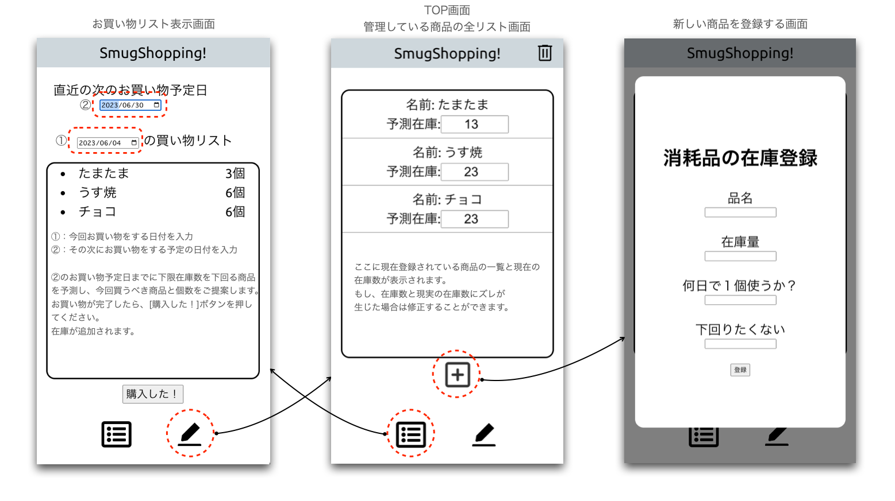

# bit-cruiser-green-field

#　　このアプリの目的
このアプリは日々のお買い物を支援する事を目的に作られました。
定期的に購入する商品や在庫数を管理し、お買い物日に買うべき商品と購入数を自動で計算し提案してくれます。
アプリの提案通りに購入する事で在庫切れの心配がなくります。
楽天スーパーセールでの買いまわりの補助として使用すると、買い忘れによる
ポイント UP の機会損失を軽減できるでしょう！

#　　利用方法
このアプリは web アプリケーションとしてサービスを提供しています。
URL：https://bitcruiser.onrender.com/
にアクセスし利用してください。

#　　使用方法

#　　このアプリについてのご要望
GitHub:yoshinori-matsubara まで！

使用するメソッド：
GET
POST

更新履歴：
2023/05/30 frontend、backend フォルダを作成し、各々 package.json を作成
